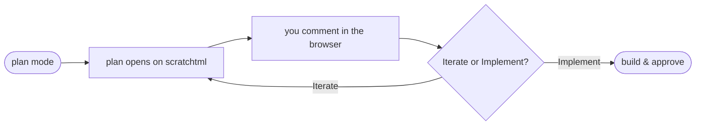

<p align="center">
  
</p>

<h1 align="center">scratchtml for Claude Code</h1>

<p align="center">Review and iterate on Claude's plans like you would in Notion — and share any document Claude generates (reports, design docs, UI mockups) on an ephemeral, sandboxed, commentable link.</p>

<p align="center">
  
</p>

<p align="center"><sub><b>⏸ plan mode on</b> — review and iterate on Claude plans like you would in Notion.</sub></p>

## Install

```
/plugin marketplace add znat/scratchtml-claude-plugin
/plugin install scratchtml@scratchtml
/mcp          ← then authenticate "scratchtml" (browser sign-in)
```

Do the `/mcp` sign-in right away — it's what lets the first upload succeed. Then ask Claude to plan your next feature.

## How it works

Enter **plan mode** and the plugin shapes the plan as it's authored (HTML mockups, mermaid diagrams, callouts), then routes it through a review loop instead of letting it go straight to approval — for **every** plan, in any permission mode:



Both menu choices pull your comments — **Iterate** folds them into a plan revision, **Implement** applies them as Claude writes the code. Iterating re-uploads as a new **version** of the *same link* (your comments carry forward and you can diff against the prior version), so you can keep one tab open across rounds.

## Share anything, anytime

Beyond plan mode, any document Claude produces shares for inline review with a single command:

| Command | What it does |
|---|---|
| `/scratchtml:share [path]` | Upload any markdown/HTML document → shareable, commentable 24h link |
| `/scratchtml:get [slug-or-url]` | Pull inline comments, each paired with the text it refers to |
| `/scratchtml:list` | List your uploaded documents (links + expiry) |

## Make it yours

All options are prompted at install and editable later via `/plugin`:

| Option | Default | Effect |
|---|---|---|
| `plan_review` | `true` | Prime plan authoring, then intercept plan exit and run the review loop |
| `auto_open` | `true` | Open uploaded plans in your browser automatically |
| `approve_mode` | `ask` | `ask`: built-in approval dialog after review. `auto`: reviewed plans are approved automatically in auto mode |
| `ui_mockups` | `true` | Encourage Claude to embed inline HTML/CSS mockups for UI sections of plans |
| `diagrams` | `true` | Encourage Claude to use mermaid fences for flows and architecture diagrams |

**Opting out** — tell Claude "skip the scratchtml review" for a single plan, flip any option via `/plugin`, or disable entirely with `claude plugin disable scratchtml@scratchtml`.
